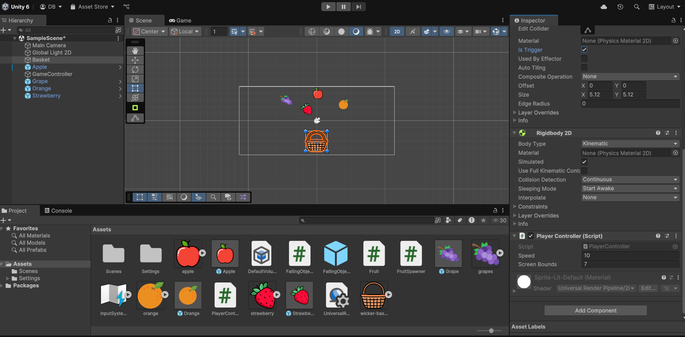
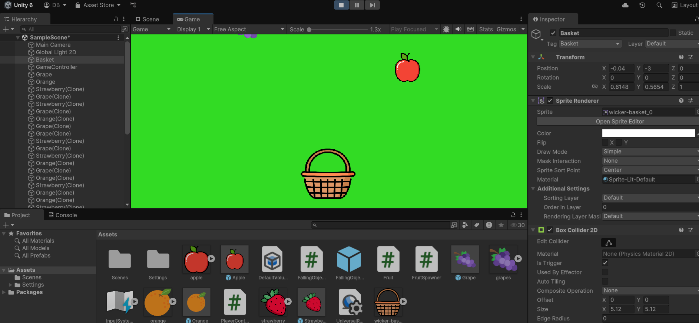

# FallingFruitsGame Documentation
## Introduction
Welcome to Falling Fruits, a fun and engaging 2D game where you control a basket to catch falling fruits! The goal of the game is to catch as many fruits as possible to obtain the buggest score. There are different fruits which can bring you different amount of the score and that can fall with various speed. Also, there are "bad" fruits which will destroy your "life" if you catch them. It is planned to give 3 lives to the player and the game is over when player loses all his lives.
## Gameplay Overview
In **Falling Fruits** , you control a basket that moves horizontally at the bottom of the screen to catch fruits falling from above. Your objective is to catch the fruits using the basket and to achieve as great score as possible. Each caught fruit gives you points. Also, you need to avoid "bad" fruits which will destoy your life. 
## Controls
**Move Left:** Use the left arrow key or A key to move the basket to the left.

**Move Right:** Use the right arrow key or D key to move the basket to the right.
## Objectives
**#1** Catch as many falling fruits as you can.

**#2** Each time you catch a fruit, your score increases.

**#3** Each time you catch a bad fruit, you lose your live.

**#4** When you lose your third life, game is over.
## Game Features
**Various Fruits:** Apples, oranges, grape, and other fruits fall at random intervals with different speed.

**Bad Fruits:** If you catch a bad fruit, it will destroy your life.

**Difficulty Increase:** As time progresses, fruits fall faster, increasing the difficulty.

**Score Tracker:** Your score is displayed on the screen, updating with each fruit caught.

**Background:** A simple, colorful background adds a fun atmosphere to the game.

**Catch & Destroy Mechanism:** Fruits are destroyed once they are caught by the basket.

## Development Overview
### Game Setup
- **Game Type:** 2D platformer
- **Engine:** Unity
- **Platform:** PC, Web, or Mobile (depending on configuration)

### Game Components
1. **Basket:**
   - The player controls the basket at the bottom of the screen.
   - The basket has a **Collider2D** that detects collisions with falling fruits.
   
2. **Fruits:**
   - Fruits are represented by different sprites (apples, bananas, oranges).
   - Each fruit has a **Collider2D** for collision detection and a **Rigidbody2D** for gravity.

3. **Game Manager:**
   - Responsible for spawning fruits at random positions and intervals.
   - Handles the score, game over conditions, and fruit spawn rate.

### Main Scripts
1. **FruitSpawn Script:**
   - Spawns fruits at random intervals and positions on the screen.
   - Changes the fruit type randomly by using an array of fruit prefabs.

   **Key Functions:**
   - `Start`: Initializes the spawning process and starts the timer.
   - `SpawnFruit`: Spawns a new fruit at a random position.
   - `Fruit Destruction`: Destroys fruits when they are caught by the basket.

2. **Fruit Script:**
   - Handles collision detection between fruits and the basket.
   - Destroys the fruit when it is caught by the basket.

   **Key Functions:**
   - `OnCollisionEnter2D`: Detects when a fruit collides with the basket and destroys the fruit.

3. **Basket Movement Script:**
   - Moves the basket horizontally based on player input (arrow keys or mobile buttons). Moves the basket left and right based on the input.
   
## Game Screenshots
Game in dev stage:

Game running:

